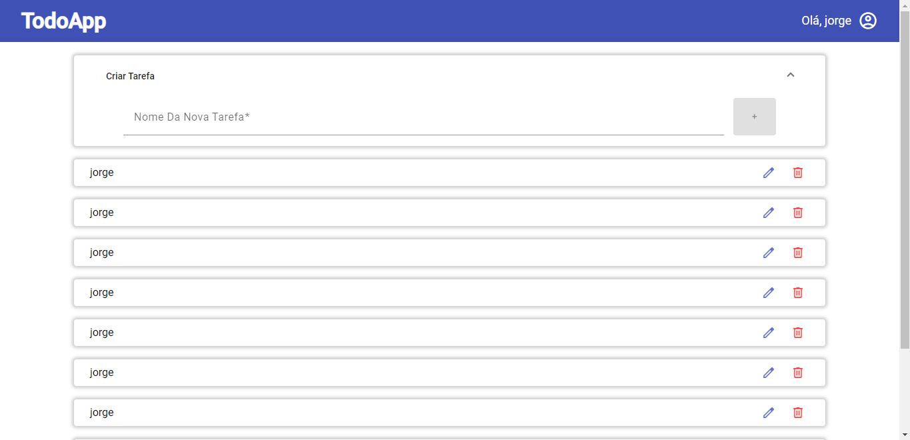
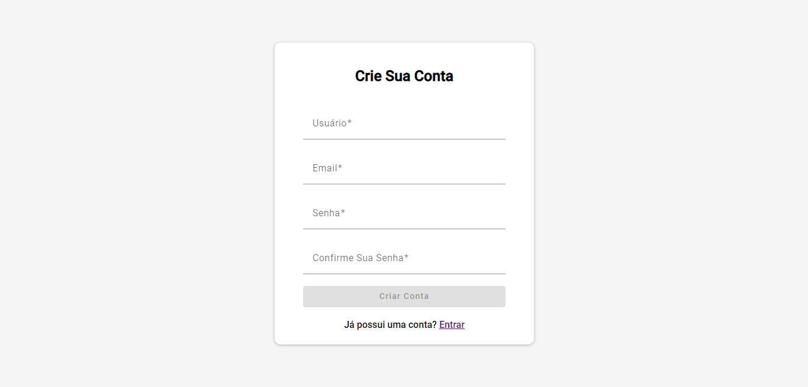
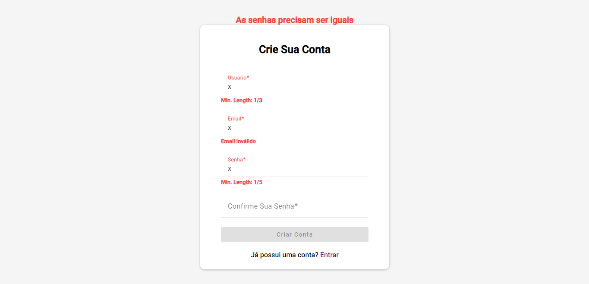
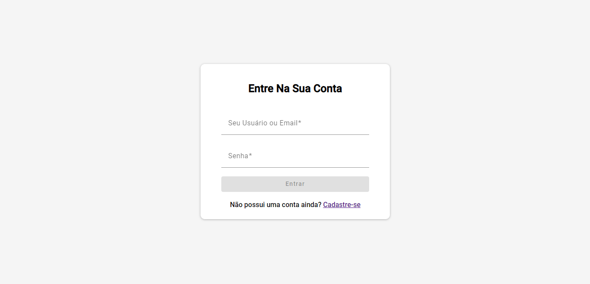

<div align="right">

</div>

<div align="right">
  
  [](README.md)
  
</div>

<p align="center"> 
  
     
  <a href="https://github.com/jorge933">
    
  </a>

</p>

<p align="center">
 <a href="#information_source-sobre">Sobre</a> •
 <a href="#arrow_forward-executar">Executar</a> •
 <a href="#hammer_and_wrench-tecnologias">Tecnologias</a> • 
 <a href="#boy-autor">Autor</a>
</p>

---

## 👁️‍🗨️ **Visualizar**

<div align="center">

| :computer:Previews  
| :--------------------------------------------------------------------------:
| <kbd></kbd> |
| <kbd></kbd> |
| <kbd></kbd> |
| <kbd></kbd> |

</div>
  
---
## ℹ️ _Sobre_

<div align="center">

Todo App feito em Angular.

---

</div>

</div>

## ▶️ **Executar**

<div align="center">

⚠️ Atenção este projeto está em desenvolvimentos algumas funcionalidades/páginas podem estar incompletas ou conter bugs😁

Para executar esse projeto você precisa baixar este repositório, ter o Gerenciador de Pacotes do Node ([`NPM`](https://www.npmjs.com/get-npm)) ou o Gerenciador de Pacotes YARN ([`YARN`](https://yarnpkg.com/getting-started)) instalado.

> ⚠️ Você também precisará do backend que está disponibilizado no seguinte repositório, (https://github.com/jorge933/todo-app-api)

Abra o prompt de comando no diretório do projeto na pasta <code>todo-app-front</code>, e execute os seguintes códigos:

<details>
  <summary><i>com <b>npm</b></i></summary>
  
  ```bash
  # Instalar dependências
  $ npm install ou npm i

# Iniciar o servidor de desenvolvimento

$ npm start

````

</details>

<details>
<summary><i>com <b>yarn</b></i></summary>

```bash
# Instalar dependências
$ yarn install

# Iniciar o servidor de desenvolvimento
$ yarn start

````

</details>

> ⚠️ O servidor de desenvolvimento será iniciado na porta: 4200 - Acesse <http://localhost:4200>

</div>

---

## :hammer*and_wrench: \_Tecnologias*

<div align="center">

|                          🌐 FrontEnd                          |
| :-----------------------------------------------------------: |
|               [Angular 17](https://angular.io/)               |
|      [Angular Material 17](https://material.angular.io/)      |
|      [Typescript 5.2.2](https://www.typescriptlang.org/)      |
| [RxJS 7.8.0](https://rxjs-dev.firebaseapp.com/guide/overview) |
|                [SCSS](https://sass-lang.com/)                 |

</div>

---

## 👦 _Autor_

<div align="center">

<a href="https://github.com/jorge933">
 
 <br/>
 <sub><b>Jorge Vitor Pimentel</b></sub>
</a>

Desenvolvido com ❤️ porJorge Vitor Pimentel 👋🏽 Meus Contatos!

[](https://www.linkedin.com/in/jorge-vitor-pimentel/)
[](https://github.com/jorge933)
[](mailto:jorgevitorp9@gmail.com)

</div>

---

## :balance*scale: \_Licença*

<div align="center">

Copyright ©️ 2024 [Jorge Vitor Pimentel ](https://github.com/jorge933).<br />

</div>
